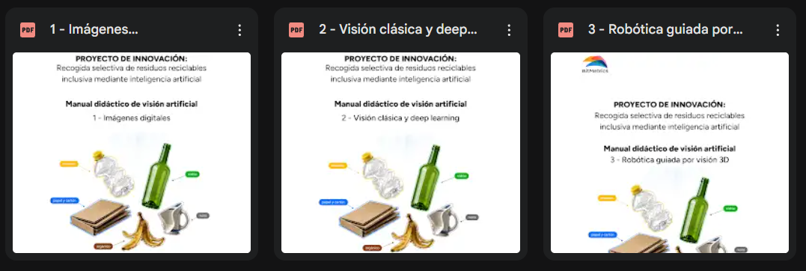

# FPInnova
Repositorio con las fotos, presentaciones y documentación del proyecto

## 📁 Estructura del Repositorio

Este repositorio está organizado en tres carpetas principales que documentan el desarrollo y las actividades del proyecto FPInnova:

### 📄 Documentación/
Contiene los materiales publicitarios del proyecto:
- `Publicidad_BitMetrics_final.pdf` - Material publicitario final de BitMetrics

### 📸 Fotos/
Archivo fotográfico organizado cronológicamente por eventos y actividades del proyecto:

#### **Formacion en UR/**
- Fotos de la formación realizada en las oficinas de Universal Robots
- Incluye 13 imágenes del evento y captura de reunión online

#### **Fotos Formacion Bernat el Ferrer/**
- Fotos de la formación en Bernat el Ferrer

#### **Reunion online/**
- Captura de pantalla de la reunión online de seguimiento

#### **Evento de cierre en Bernat el Ferrer/**
- Fotos del evento de cierre del proyecto en Bernat el Ferrer
- Incluye fotografías y un vídeo del evento final

### 📚 Material didáctico/
Recursos educativos y presentaciones utilizadas en las formaciones:
- `1 - Imágenes Digitales.pdf` - Módulo sobre imágenes digitales
- `2 - Visión clásica y deep learning.pdf` - Módulo sobre visión artificial clásica y deep learning
- `3 - Robótica guiada por visión.docx.pdf` - Módulo sobre robótica guiada por visión
- `Presentación Formación UR.pdf` - Presentación principal de la formación en la Universidad de La Rioja

#### Estación de Trabajo BitMetrics

*Estación de trabajo utilizada en las formaciones, ubicada en las oficinas de BitMetrics. La instalación incluye el robot colaborativo, la cámara de visión artificial y el rack de contenedores para los ejercicios prácticos.*
